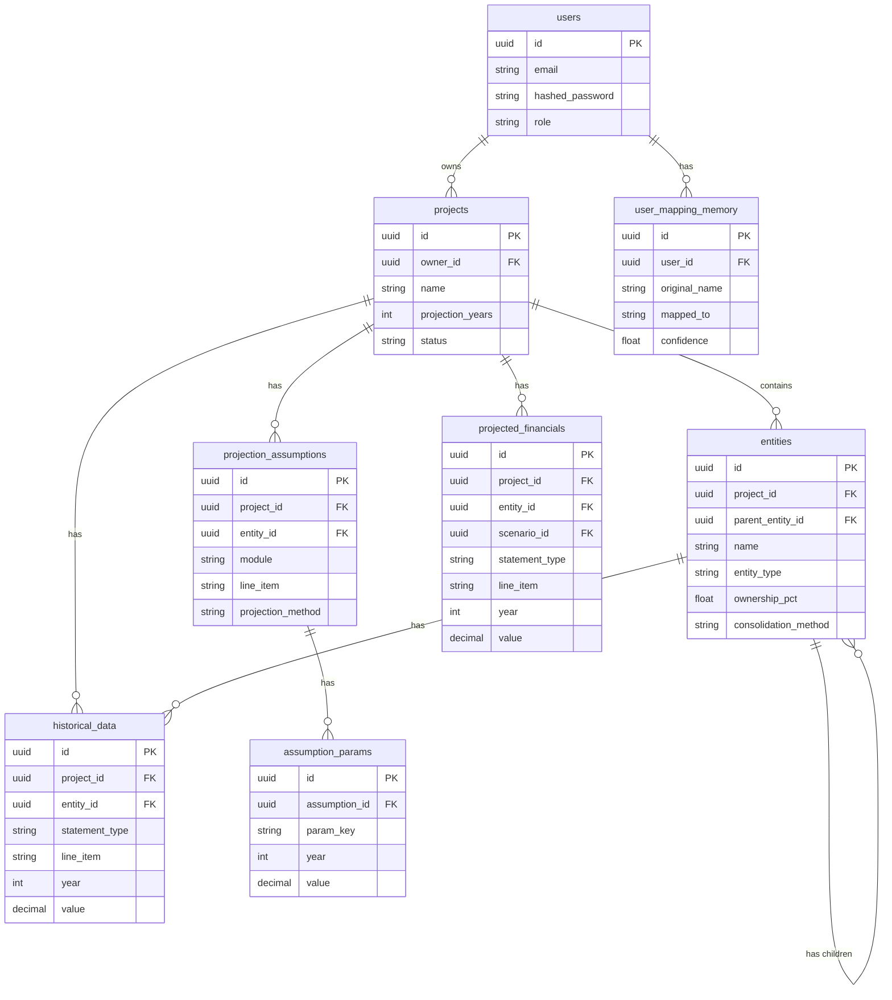

# Financial Modeler - Architecture

## Overview

The Financial Modeler is a web application that allows users to ingest historical financial data (from CSV, Excel, or via AI extraction), map it to a standard Chart of Accounts, configure projection assumptions, and generate projected P&L, Balance Sheet, and Cash Flow statements.

## Tech Stack

- **Frontend:** React (Vite), TypeScript, Tailwind CSS, React Query
- **Backend:** FastAPI, Python 3.11, SQLAlchemy, Celery (for async tasks)
- **Database:** PostgreSQL (primary), Redis (cache & message broker)

## Database Schema (ER Diagram)

Below is the Entity-Relationship diagram for the core data models:

## Application Flow

1. **Upload & Mapping:** Users upload a file (e.g., Excel). `document_extractor.py` reads it safely. `ai_mapper.py` guesses the mapping to canonical line items.
2. **Configuration:** Users review the historical data and setup assumptions per module (Revenue, COGS, OpEx, etc).
3. **Projection Engine:** `projections_runner.py` reads historicals and assumptions, running the 21-step accounting logic.
4. **Celery Worker:** If the projection is long (>10 years), the HTTP endpoint returns a `202 Accepted` and offloads the calculation to a Redis-backed Celery worker.
